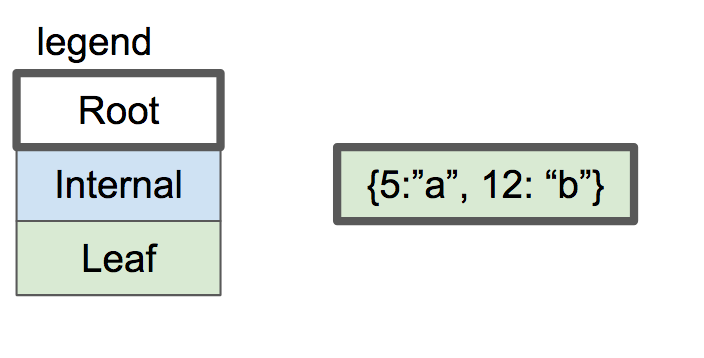

우리 B-Tree는 오직 한 노드만 갖고 있어 트리 같지는 않았다. 이를 해결 위해 리프 노드를 두 개로 분리하는 코드가 필요하다. 그 이후 두 리프 노드를 부모로 하는 인터널 노드를 만들어야 한다.

이번 글에서 우리 목표는 다음과 같다.:



이렇게 바꾸는 것이다.:


먼저 전체 리프 노드에 대한 오류 처리 부분을 제거하자.:

```diff
 void leaf_node_insert(Cursor* cursor, uint32_t key, Row* value) {
   void* node = get_page(cursor->table->pager, cursor->page_num);
 
   uint32_t num_cells = *leaf_node_num_cells(node);
   if (num_cells >= LEAF_NODE_MAX_CELLS) {
     // Node full
-    printf("Need to implement splitting a leaf node.\n");
-    exit(EXIT_FAILURE);
+    leaf_node_split_and_insert(cursor, key, value);
+    return;
   }
```

```diff
ExecuteResult execute_insert(Statement* statement, Table* table) {
   void* node = get_page(table->pager, table->root_page_num);
   uint32_t num_cells = (*leaf_node_num_cells(node));
-  if (num_cells >= LEAF_NODE_MAX_CELLS) {
-    return EXECUTE_TABLE_FULL;
-  }
 
   Row* row_to_insert = &(statement->row_to_insert);
   uint32_t key_to_insert = row_to_insert->id;
```

## Splitting Algorithm

[SQLite Database System: Design and Implementation](https://play.google.com/store/books/details/Sibsankar_Haldar_SQLite_Database_System_Design_and?id=9Z6IQQnX1JEC&hl=en) 부분에 대해 읽을 필요가 있다.

> 리프 노드에 공간이 없을 경우, 우리는 거기에 상주하는 기존 항목과 새 항목(삽입 중인 항목)을 동일한 절반인 하한과 상한으로 나눌 것이다. (상부의 키는 하부의 키보다 엄격히 크다.) 우리는 새 리프 노드를 할당하고, 위쪽 절반을 새 노드로 이동한다.

이전 노드를 처리하고 새 노드를 생성해보자.:

```diff
+void leaf_node_split_and_insert(Cursor* cursor, uint32_t key, Row* value) {
+  /*
+  Create a new node and move half the cells over.
+  Insert the new value in one of the two nodes.
+  Update parent or create a new parent.
+  */
+
+  void* old_node = get_page(cursor->table->pager, cursor->page_num);
+  uint32_t new_page_num = get_unused_page_num(cursor->table->pager);
+  void* new_node = get_page(cursor->table->pager, new_page_num);
+  initialize_leaf_node(new_node);
```

모든 셀을 새 위치로 복사한다.:

```diff
+  /*
+  All existing keys plus new key should should be divided
+  evenly between old (left) and new (right) nodes.
+  Starting from the right, move each key to correct position.
+  */
+  for (int32_t i = LEAF_NODE_MAX_CELLS; i >= 0; i--) {
+    void* destination_node;
+    if (i >= LEAF_NODE_LEFT_SPLIT_COUNT) {
+      destination_node = new_node;
+    } else {
+      destination_node = old_node;
+    }
+    uint32_t index_within_node = i % LEAF_NODE_LEFT_SPLIT_COUNT;
+    void* destination = leaf_node_cell(destination_node, index_within_node);
+
+    if (i == cursor->cell_num) {
+      serialize_row(value, destination);
+    } else if (i > cursor->cell_num) {
+      memcpy(destination, leaf_node_cell(old_node, i - 1), LEAF_NODE_CELL_SIZE);
+    } else {
+      memcpy(destination, leaf_node_cell(old_node, i), LEAF_NODE_CELL_SIZE);
+    }
+  }
```

각 노드 헤더 셀 개수를 갱신한다.:

```diff
+  /* Update cell count on both leaf nodes */
+  *(leaf_node_num_cells(old_node)) = LEAF_NODE_LEFT_SPLIT_COUNT;
+  *(leaf_node_num_cells(new_node)) = LEAF_NODE_RIGHT_SPLIT_COUNT;
```

그런 다음 노드의 부모를 업데이트 해야 한다.
원래 노드가 루트 노드이면 부모가 아니다. 이 경우, 새 루트 노드 생성하고 부모 역할을 부여한다. :

```diff
+  if (is_node_root(old_node)) {
+    return create_new_root(cursor->table, new_page_num);
+  } else {
+    printf("Need to implement updating parent after split\n");
+    exit(EXIT_FAILURE);
+  }
+}
```

## Allocating New Pages

돌아 가서 새 함수와 상수를 정의해보자. 새 리프 노드가 생길 때 `get_unused_page_num()`으로 페이지를 얻는다.:

```diff
+/*
+Until we start recycling free pages, new pages will always
+go onto the end of the database file
+*/
+uint32_t get_unused_page_num(Pager* pager) { return pager->num_pages; }
```

현재, 데이터베이스에 페이지가 N개 있다고 가정하면 페이지 0번에서 N-1까지 할당되어 있다. 그러므로 새 페이지를 위해 페이지 번호 N으로 항상 할당할 수 있다. 
결국 삭제를 구현 한 후, 일부 페이지가 비어 있고 해당 페이지 번호가 사용되지 않을 수 있다. 효과적으로 하기 위해 우리는 빈 페이지를 재할당 해야한다.

## Leaf Node Sizes

트리 차수를 유지하기 위해 새 두 노드 사이에 셀들을 분산할 것이다. 리프 노드가 N 셀을 가지고 있으면 분할하는 동안 두 개의 노드 (N 개의 원래 셀과 하나의 새로운 셀) 사이에 N+1 셀을 배포 해야 한다. 
N+1이 홀수 인 경우 왼쪽 노드를 하나 더 선택하려면 임의로 선택한다.

```diff
+const uint32_t LEAF_NODE_RIGHT_SPLIT_COUNT = (LEAF_NODE_MAX_CELLS + 1) / 2;
+const uint32_t LEAF_NODE_LEFT_SPLIT_COUNT =
+    (LEAF_NODE_MAX_CELLS + 1) - LEAF_NODE_RIGHT_SPLIT_COUNT;
```

## Creating a New Root

 [SQLite Database System](https://play.google.com/store/books/details/Sibsankar_Haldar_SQLite_Database_System_Design_and?id=9Z6IQQnX1JEC&hl=en)에 새 루트 노드 생성하는 과정이 설명되어 있다.:

> 루트 노드에 셀이 N개 있다고 하자. 처음에 두 노드(L, R)를 할당한다. N개의 절반 중 낮은 키들를 L 노드에 넣고 높은 키들을 R 노드에 넣는다. N이 비어 있다. N 안에 {L, K, R} 추가한다. K는 L 안에 가장 큰 키 값이다.  페이지 N은 루트 노드에 남아있다. 트리 차수를 하나 증가하지만 새 트리는 B+tree의 특성을 위반하지 않고 높이 균형을 유지하고 있다.

요점은 우리는 오른쪽 노드 할당과 높은 키들을 그 곳에 옮겼다. 함수는 오른쪽 노드에 데이터 입력과 왼쪽 노드에 저장하기 위한 새 페이지 할당이다.

```diff
+void create_new_root(Table* table, uint32_t right_child_page_num) {
+  /*
+  Handle splitting the root.
+  Old root copied to new page, becomes left child.
+  Address of right child passed in.
+  Re-initialize root page to contain the new root node.
+  New root node points to two children.
+  */
+
+  void* root = get_page(table->pager, table->root_page_num);
+  void* right_child = get_page(table->pager, right_child_page_num);
+  uint32_t left_child_page_num = get_unused_page_num(table->pager);
+  void* left_child = get_page(table->pager, left_child_page_num);
```

예전 루트 노드는 루트 페이지를 재사용하기 위해 왼쪽 자식 노드로 복사 된다.:

```diff
+  /* Left child has data copied from old root */
+  memcpy(left_child, root, PAGE_SIZE);
+  set_node_root(left_child, false);
```

두 자식 노드를 가진 새 인터널 노드를 루트로 초기화했다.

```diff
+  /* Root node is a new internal node with one key and two children */
+  initialize_internal_node(root);
+  set_node_root(root, true);
+  *internal_node_num_keys(root) = 1;
+  *internal_node_child(root, 0) = left_child_page_num;
+  uint32_t left_child_max_key = get_node_max_key(left_child);
+  *internal_node_key(root, 0) = left_child_max_key;
+  *internal_node_right_child(root) = right_child_page_num;
+}
```

## Internal Node Format

이제 드디어 인터널 노드를 만들게 되었으니, 그 레이아웃을 정의해야 한다.
공통 헤더를 시작으로 그 안에 키의 수 그리고 오른쪽 자식 노드의 페이지 수이다. 인터널 노드에는 키가 있는 것보다 항상 하위 포인터가 하나 더 있다. 여분의 자식 포인터는 헤더에 저장되어 있다.

```diff
+/*
+ * Internal Node Header Layout
+ */
+const uint32_t INTERNAL_NODE_NUM_KEYS_SIZE = sizeof(uint32_t);
+const uint32_t INTERNAL_NODE_NUM_KEYS_OFFSET = COMMON_NODE_HEADER_SIZE;
+const uint32_t INTERNAL_NODE_RIGHT_CHILD_SIZE = sizeof(uint32_t);
+const uint32_t INTERNAL_NODE_RIGHT_CHILD_OFFSET =
+    INTERNAL_NODE_NUM_KEYS_OFFSET + INTERNAL_NODE_NUM_KEYS_SIZE;
+const uint32_t INTERNAL_NODE_HEADER_SIZE = COMMON_NODE_HEADER_SIZE +
+                                           INTERNAL_NODE_NUM_KEYS_SIZE +
+                                           INTERNAL_NODE_RIGHT_CHILD_SIZE;
```

본문은 자식 포인터와 키를 포함한 셀들의 배열이다. 모든 키는 왼쪽 자식 노드에 포함되어야 한다. 

```diff
+/*
+ * Internal Node Body Layout
+ */
+const uint32_t INTERNAL_NODE_KEY_SIZE = sizeof(uint32_t);
+const uint32_t INTERNAL_NODE_CHILD_SIZE = sizeof(uint32_t);
+const uint32_t INTERNAL_NODE_CELL_SIZE =
+    INTERNAL_NODE_CHILD_SIZE + INTERNAL_NODE_KEY_SIZE;
```

이러한 상수를 기반으로 인터널 노드의 계층을 살펴보자.:


우리의 거대한 분기 요인을 주목하라. 각각의 자식 포인터/키 쌍이 너무 작기 때문에, 우리는 각각의 내부 노드에 510개의 키와 511개의 자식 포인터를 넣을 수 있다. 그것은 우리가 주어진 키를 찾기 위해 트리의 많은 층을 횡단하지 않아도 된다는 것을 의미한다!

| # internal node layers | max # leaf nodes    | Size of all leaf nodes |
|------------------------|---------------------|------------------------|
| 0                      | 511^0 = 1           | 4 KB                   |
| 1                      | 511^1 = 512         | ~2 MB                   |
| 2                      | 511^2 = 261,121     | ~1 GB                   |
| 3                      | 511^2 = 133,432,831 | ~550 GB                 |

실제로 헤더, 키 및 낭비되는 공간 때문에 리프 노드당 전체 4KB의 데이터를 저장할 수 없다. 그러나 우리는 디스크에서 4페이지만 로드하면 500GB 정도의 데이터를 검색할 수 있다. 이것이 B-Tree가 데이터베이스에 유용한 데이터 구조인 이유다.

인터널 노드를 읽고 쓰기 위한 메소드이다.:

```diff
+uint32_t* internal_node_num_keys(void* node) {
+  return node + INTERNAL_NODE_NUM_KEYS_OFFSET;
+}
+
+uint32_t* internal_node_right_child(void* node) {
+  return node + INTERNAL_NODE_RIGHT_CHILD_OFFSET;
+}
+
+uint32_t* internal_node_cell(void* node, uint32_t cell_num) {
+  return node + INTERNAL_NODE_HEADER_SIZE + cell_num * INTERNAL_NODE_CELL_SIZE;
+}
+
+uint32_t* internal_node_child(void* node, uint32_t child_num) {
+  uint32_t num_keys = *internal_node_num_keys(node);
+  if (child_num > num_keys) {
+    printf("Tried to access child_num %d > num_keys %d\n", child_num, num_keys);
+    exit(EXIT_FAILURE);
+  } else if (child_num == num_keys) {
+    return internal_node_right_child(node);
+  } else {
+    return internal_node_cell(node, child_num);
+  }
+}
+
+uint32_t* internal_node_key(void* node, uint32_t key_num) {
+  return internal_node_cell(node, key_num) + INTERNAL_NODE_CHILD_SIZE;
+}
```

인터널 노드의 경우, 최대 키는 항상 오른쪽 키다. 리프 노드의 경우 최대 인덱스이다:


```diff
+uint32_t get_node_max_key(void* node) {
+  switch (get_node_type(node)) {
+    case NODE_INTERNAL:
+      return *internal_node_key(node, *internal_node_num_keys(node) - 1);
+    case NODE_LEAF:
+      return *leaf_node_key(node, *leaf_node_num_cells(node) - 1);
+  }
+}
```

## Keeping Track of the Root

공통 노드 헤더 내에 `is_root` 필드를 이용할 것이다. 
리프 노드를 분할하는 방법을 결정하는 데 사용하는 것을 상기해라.:

```c
  if (is_node_root(old_node)) {
    return create_new_root(cursor->table, new_page_num);
  } else {
    printf("Need to implement updating parent after split\n");
    exit(EXIT_FAILURE);
  }
}
```

getter/setter는 다음과 같다.:

```diff
+bool is_node_root(void* node) {
+  uint8_t value = *((uint8_t*)(node + IS_ROOT_OFFSET));
+  return (bool)value;
+}
+
+void set_node_root(void* node, bool is_root) {
+  uint8_t value = is_root;
+  *((uint8_t*)(node + IS_ROOT_OFFSET)) = value;
+}
```

인터널, 리프 노드 둘 다 `is_root`를 false로 기본 세팅해 놓는다.:

```diff
 void initialize_leaf_node(void* node) {
   set_node_type(node, NODE_LEAF);
+  set_node_root(node, false);
   *leaf_node_num_cells(node) = 0;
 }

+void initialize_internal_node(void* node) {
+  set_node_type(node, NODE_INTERNAL);
+  set_node_root(node, false);
+  *internal_node_num_keys(node) = 0;
+}
```

테이블에 첫 노드가 생성 시 `is_root`를 true로 설정해야 한다.:

```diff
     // New database file. Initialize page 0 as leaf node.
     void* root_node = get_page(pager, 0);
     initialize_leaf_node(root_node);
+    set_node_root(root_node, true);
   }
 
   return table;
```

## Printing the Tree

데이터베이스 상태를 시각화하기 위해 다계층 트리를 출력하기 위해 `.btree` 메타명령을 업데이트해야한다.

현재 `print_leaf_node()` 함수를 대체할 것이다.

```diff
-void print_leaf_node(void* node) {
-  uint32_t num_cells = *leaf_node_num_cells(node);
-  printf("leaf (size %d)\n", num_cells);
-  for (uint32_t i = 0; i < num_cells; i++) {
-    uint32_t key = *leaf_node_key(node, i);
-    printf("  - %d : %d\n", i, key);
-  }
-}
```

어떤 노드를 가져다가 그 노드와 그 자식들을 인쇄하는 새로운 재귀 기능을 가지고 있다. 그것은 매개 변수로서 들여쓰기 수준을 가져가고, 그것은 각각의 반복적인 호출에 따라 증가한다. 약간의 헬퍼도 추가하고 있다.


```diff
+void indent(uint32_t level) {
+  for (uint32_t i = 0; i < level; i++) {
+    printf("  ");
+  }
+}
+
+void print_tree(Pager* pager, uint32_t page_num, uint32_t indentation_level) {
+  void* node = get_page(pager, page_num);
+  uint32_t num_keys, child;
+
+  switch (get_node_type(node)) {
+    case (NODE_LEAF):
+      num_keys = *leaf_node_num_cells(node);
+      indent(indentation_level);
+      printf("- leaf (size %d)\n", num_keys);
+      for (uint32_t i = 0; i < num_keys; i++) {
+        indent(indentation_level + 1);
+        printf("- %d\n", *leaf_node_key(node, i));
+      }
+      break;
+    case (NODE_INTERNAL):
+      num_keys = *internal_node_num_keys(node);
+      indent(indentation_level);
+      printf("- internal (size %d)\n", num_keys);
+      for (uint32_t i = 0; i < num_keys; i++) {
+        child = *internal_node_child(node, i);
+        print_tree(pager, child, indentation_level + 1);
+
+        indent(indentation_level);
+        printf("- key %d\n", *internal_node_key(node, i));
+      }
+      child = *internal_node_right_child(node);
+      print_tree(pager, child, indentation_level + 1);
+      break;
+  }
+}
```

`print_tree` 함수를 호출해보자.


```diff
   } else if (strcmp(input_buffer->buffer, ".btree") == 0) {
     printf("Tree:\n");
-    print_leaf_node(get_page(table->pager, 0));
+    print_tree(table->pager, 0, 0);
     return META_COMMAND_SUCCESS;
```

여기 새로운 출력 기능에 대한 테스트 사례가 있다!

```diff
+  it 'allows printing out the structure of a 3-leaf-node btree' do
+    script = (1..14).map do |i|
+      "insert #{i} user#{i} person#{i}@example.com"
+    end
+    script << ".btree"
+    script << "insert 15 user15 person15@example.com"
+    script << ".exit"
+    result = run_script(script)
+
+    expect(result[14...(result.length)]).to eq([
+      "db > Tree:",
+      "- internal (size 1)",
+      "  - leaf (size 7)",
+      "    - 1",
+      "    - 2",
+      "    - 3",
+      "    - 4",
+      "    - 5",
+      "    - 6",
+      "    - 7",
+      "- key 7",
+      "  - leaf (size 7)",
+      "    - 8",
+      "    - 9",
+      "    - 10",
+      "    - 11",
+      "    - 12",
+      "    - 13",
+      "    - 14",
+      "db > Need to implement searching an internal node",
+    ])
+  end
```

새로운 형식은 약간 단순해 기존 .btree 시험을 업데이트해야 한다.:

```diff
       "db > Executed.",
       "db > Executed.",
       "db > Tree:",
-      "leaf (size 3)",
-      "  - 0 : 1",
-      "  - 1 : 2",
-      "  - 2 : 3",
+      "- leaf (size 3)",
+      "  - 1",
+      "  - 2",
+      "  - 3",
       "db > "
     ])
   end
```

`.btree` 결과 값은 다음과 같다.:

```
Tree:
- internal (size 1)
  - leaf (size 7)
    - 1
    - 2
    - 3
    - 4
    - 5
    - 6
    - 7
  - key 7
  - leaf (size 7)
    - 8
    - 9
    - 10
    - 11
    - 12
    - 13
    - 14
```

가장 작은 수준에서 루트 노드(내부 노드)를 본다.  키가 하나여서 `size 1`이라고 적혀 있다. 한 레벨이 표시되면, 우리는 리프 노드, 키, 그리고 또 다른 리프 노드를 볼 수 있다. 루트 노드(7)의 키는 첫 번째 리프 노드의 최대 키다. 7보다 큰 모든 키는 두 번째 리프 노드에 있다.

## A Major Problem

만약 당신이 잘 따라왔다면 우리가 무언가 큰 것을 놓쳤다는 것을 알아차릴 수 있을 것이다. 한 행을 추가하려고 하면 어떻게 되는지 확인해라.:

```
db > insert 15 user15 person15@example.com
Need to implement searching an internal node
```

다음 글에서 multi-level tree에 대해 계속해서 진행햘 것이다.
