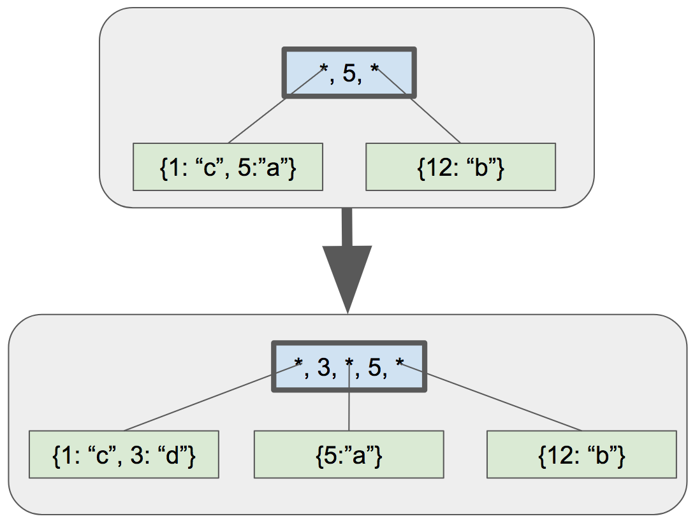

우리의 서사시적인 b-tree 구현 여정의 다음 단계를 위해, 우리는 리프 노드을 쪼개서 부모 노드를 고정하는 일을 처리할 것이다. 예시 그림이다.:



예시로, 키 "3"을 트리에 추가한다. 왼쪽 리프노드는 분할 한다. 분할한 후에 다음과 같이 트리가 동작하게 변경한다.:

1.  부모에서 첫 번째 키를 왼쪽 자식의 최대 키("3")로 업데이트
2. 업데이트된 키 다음에 새 하위 포인터/키 쌍 추가
  - 새 포인터가 새 하위 노드를 가리킴
  - 새 키는 새 하위 노드의 최대 키("5")

두 새로운 함수를 호출하도록 대체해보자.:
`update_internal_node_key()`는 1단계 `internal_node_insert()`는 2단계에 해당한다.


```diff
@@ -670,9 +725,11 @@ void leaf_node_split_and_insert(Cursor* cursor, uint32_t key, Row* value) {
   */
 
   void* old_node = get_page(cursor->table->pager, cursor->page_num);
+  uint32_t old_max = get_node_max_key(old_node);
   uint32_t new_page_num = get_unused_page_num(cursor->table->pager);
   void* new_node = get_page(cursor->table->pager, new_page_num);
   initialize_leaf_node(new_node);
+  *node_parent(new_node) = *node_parent(old_node);
   *leaf_node_next_leaf(new_node) = *leaf_node_next_leaf(old_node);
   *leaf_node_next_leaf(old_node) = new_page_num;
 
@@ -709,8 +766,12 @@ void leaf_node_split_and_insert(Cursor* cursor, uint32_t key, Row* value) {
   if (is_node_root(old_node)) {
     return create_new_root(cursor->table, new_page_num);
   } else {
-    printf("Need to implement updating parent after split\n");
-    exit(EXIT_FAILURE);
+    uint32_t parent_page_num = *node_parent(old_node);
+    uint32_t new_max = get_node_max_key(old_node);
+    void* parent = get_page(cursor->table->pager, parent_page_num);
+
+    update_internal_node_key(parent, old_max, new_max);
+    internal_node_insert(cursor->table, parent_page_num, new_page_num);
+    return;
   }
 }
```

부모 노드에 대한 참조를 얻으려면 각 노드에서 부모 노드에 대한 포인터를 기록해야 한다.

```diff
+uint32_t* node_parent(void* node) { return node + PARENT_POINTER_OFFSET; }
```
```diff
@@ -660,6 +675,48 @@ void create_new_root(Table* table, uint32_t right_child_page_num) {
   uint32_t left_child_max_key = get_node_max_key(left_child);
   *internal_node_key(root, 0) = left_child_max_key;
   *internal_node_right_child(root) = right_child_page_num;
+  *node_parent(left_child) = table->root_page_num;
+  *node_parent(right_child) = table->root_page_num;
 }
```

부모 노드 안에 영향받은 셀을 찾아야한다. 자식 노드든 부모 노드에 자신의 페이지번호를 알지 못하기 때문에 찾을 수 없다. 하지만 자신의 최대 키를 알 수 있기 때문에 그 키를 부모에서 찾을 수 있다.

```diff
+void update_internal_node_key(void* node, uint32_t old_key, uint32_t new_key) {
+  uint32_t old_child_index = internal_node_find_child(node, old_key);
+  *internal_node_key(node, old_child_index) = new_key;
 }
```
`internal_node_find_child()` 내부는 인터널 노드 키를 찾기 위해 이미 구현된 코드를 재활용하자. 새로 헬퍼 메소드로 이용하기 위해 `internal_node_find()`를 리펙토링한다.

```diff
-Cursor* internal_node_find(Table* table, uint32_t page_num, uint32_t key) {
-  void* node = get_page(table->pager, page_num);
+uint32_t internal_node_find_child(void* node, uint32_t key) {
+  /*
+  Return the index of the child which should contain
+  the given key.
+  */
+
   uint32_t num_keys = *internal_node_num_keys(node);
 
-  /* Binary search to find index of child to search */
+  /* Binary search */
   uint32_t min_index = 0;
   uint32_t max_index = num_keys; /* there is one more child than key */
 
@@ -386,7 +394,14 @@ Cursor* internal_node_find(Table* table, uint32_t page_num, uint32_t key) {
     }
   }
 
-  uint32_t child_num = *internal_node_child(node, min_index);
+  return min_index;
+}
+
+Cursor* internal_node_find(Table* table, uint32_t page_num, uint32_t key) {
+  void* node = get_page(table->pager, page_num);
+
+  uint32_t child_index = internal_node_find_child(node, key);
+  uint32_t child_num = *internal_node_child(node, child_index);
   void* child = get_page(table->pager, child_num);
   switch (get_node_type(child)) {
     case NODE_LEAF:
```

이제 `internal_node_insert()`를 구현해 이 글의 핵심에 도달한다. 부분부분 설명하겠다.

```diff
+void internal_node_insert(Table* table, uint32_t parent_page_num,
+                          uint32_t child_page_num) {
+  /*
+  Add a new child/key pair to parent that corresponds to child
+  */
+
+  void* parent = get_page(table->pager, parent_page_num);
+  void* child = get_page(table->pager, child_page_num);
+  uint32_t child_max_key = get_node_max_key(child);
+  uint32_t index = internal_node_find_child(parent, child_max_key);
+
+  uint32_t original_num_keys = *internal_node_num_keys(parent);
+  *internal_node_num_keys(parent) = original_num_keys + 1;
+
+  if (original_num_keys >= INTERNAL_NODE_MAX_CELLS) {
+    printf("Need to implement splitting internal node\n");
+    exit(EXIT_FAILURE);
+  }
```

새 셀(하위/키 쌍)을 삽입해야 하는 인덱스는 새 자식 노드의 최대 키에 따라 달라진다.
예를 들어, `child_max_key`의 값은 5, `index`는 1이라고 하자.

다른 셀을 위한 인터널 노드 내 공간이 없다면 에러를 발생한다. 나중에 구현할 것이다.

이제 나머지 기능을 살펴보기로 하자.:

```diff
+
+  uint32_t right_child_page_num = *internal_node_right_child(parent);
+  void* right_child = get_page(table->pager, right_child_page_num);
+
+  if (child_max_key > get_node_max_key(right_child)) {
+    /* Replace right child */
+    *internal_node_child(parent, original_num_keys) = right_child_page_num;
+    *internal_node_key(parent, original_num_keys) =
+        get_node_max_key(right_child);
+    *internal_node_right_child(parent) = child_page_num;
+  } else {
+    /* Make room for the new cell */
+    for (uint32_t i = original_num_keys; i > index; i--) {
+      void* destination = internal_node_cell(parent, i);
+      void* source = internal_node_cell(parent, i - 1);
+      memcpy(destination, source, INTERNAL_NODE_CELL_SIZE);
+    }
+    *internal_node_child(parent, index) = child_page_num;
+    *internal_node_key(parent, index) = child_max_key;
+  }
+}
```

가장 오른쪽의 자식 포인터를 나머지 어린이/키 쌍과 별도로 저장하기 때문에, 만약 새로운 아이가 가장 오른쪽 아이가 될 것이라면, 우리는 다른 방식으로 일을 처리해야 한다.

우리의 예에서 우리는 'else' 블록에 들어갈 것이다. 우선 우리는 다른 셀들을 오른쪽으로 한 칸 옮겨서 새로운 셀를 위한 공간을 만든다. (이 예에서 전환할 셀은 0개임)

다음으로는 새로운 자식 포인터와 키를 `index`에 의해 결정된 셀에 적는다.

필요한 테스트케이스 크기를 줄이기 위해 일단 하드코딩으로 `INTERNAL_NODE_MAX_CELLS`을 추가했다.

```diff
@@ -126,6 +126,8 @@ const uint32_t INTERNAL_NODE_KEY_SIZE = sizeof(uint32_t);
 const uint32_t INTERNAL_NODE_CHILD_SIZE = sizeof(uint32_t);
 const uint32_t INTERNAL_NODE_CELL_SIZE =
     INTERNAL_NODE_CHILD_SIZE + INTERNAL_NODE_KEY_SIZE;
+/* Keep this small for testing */
+const uint32_t INTERNAL_NODE_MAX_CELLS = 3;
```

테스트 얘기가 나와서 말인데, 우리의 큰 데이타셋 테스트는 우리의 예전 스텁을 지나 새로운 스텁에 도달한다.:

```diff
@@ -65,7 +65,7 @@ describe 'database' do
     result = run_script(script)
     expect(result.last(2)).to eq([
       "db > Executed.",
-      "db > Need to implement updating parent after split",
+      "db > Need to implement splitting internal node",
     ])
```

노드 4개를 출력하는 케이스를 한 번 더 추가하겠다. 단지 순차 ID보다 더 많은 사례를 테스트하기 위해서, 이 테스트는 무작위 순서로 레코드를 추가할 것이다.

```diff
+  it 'allows printing out the structure of a 4-leaf-node btree' do
+    script = [
+      "insert 18 user18 person18@example.com",
+      "insert 7 user7 person7@example.com",
+      "insert 10 user10 person10@example.com",
+      "insert 29 user29 person29@example.com",
+      "insert 23 user23 person23@example.com",
+      "insert 4 user4 person4@example.com",
+      "insert 14 user14 person14@example.com",
+      "insert 30 user30 person30@example.com",
+      "insert 15 user15 person15@example.com",
+      "insert 26 user26 person26@example.com",
+      "insert 22 user22 person22@example.com",
+      "insert 19 user19 person19@example.com",
+      "insert 2 user2 person2@example.com",
+      "insert 1 user1 person1@example.com",
+      "insert 21 user21 person21@example.com",
+      "insert 11 user11 person11@example.com",
+      "insert 6 user6 person6@example.com",
+      "insert 20 user20 person20@example.com",
+      "insert 5 user5 person5@example.com",
+      "insert 8 user8 person8@example.com",
+      "insert 9 user9 person9@example.com",
+      "insert 3 user3 person3@example.com",
+      "insert 12 user12 person12@example.com",
+      "insert 27 user27 person27@example.com",
+      "insert 17 user17 person17@example.com",
+      "insert 16 user16 person16@example.com",
+      "insert 13 user13 person13@example.com",
+      "insert 24 user24 person24@example.com",
+      "insert 25 user25 person25@example.com",
+      "insert 28 user28 person28@example.com",
+      ".btree",
+      ".exit",
+    ]
+    result = run_script(script)
```

결과는 다음과 같다.:

```
- internal (size 3)
  - leaf (size 7)
    - 1
    - 2
    - 3
    - 4
    - 5
    - 6
    - 7
  - key 1
  - leaf (size 8)
    - 8
    - 9
    - 10
    - 11
    - 12
    - 13
    - 14
    - 15
  - key 15
  - leaf (size 7)
    - 16
    - 17
    - 18
    - 19
    - 20
    - 21
    - 22
  - key 22
  - leaf (size 8)
    - 23
    - 24
    - 25
    - 26
    - 27
    - 28
    - 29
    - 30
db >
```

버그 발생 지점이다.:
```
    - 5
    - 6
    - 7
  - key 1
```

그 키는 1이 아니라 7이 되어야 한다!

여러 번 디버깅한 후에, 나는 이것이 잘못된 포인터 계산 때문이라는 것을 알았다.

```diff
 uint32_t* internal_node_key(void* node, uint32_t key_num) {
-  return internal_node_cell(node, key_num) + INTERNAL_NODE_CHILD_SIZE;
+  return (void*)internal_node_cell(node, key_num) + INTERNAL_NODE_CHILD_SIZE;
 }
```

`INTERNAL_NODE_CHILD_SIZE` 의 값은 4이다. 여기서 나의 의도는 internal_node_cell()의 결과에 4바이트를 더하는 것이었으나 internal_node_cell()이 uint32_t*를 반환하므로 실제로는 4 *size off(uint32_t) 바이트를 추가하는 것이었다. 계산 하기 전에 `void*`에 캐스팅하여 고쳤다.

[Pointer arithmetic on void pointers is not part of the C standard and may not work with your compiler](https://stackoverflow.com/questions/3523145/pointer-arithmetic-for-void-pointer-in-c/46238658#46238658). 나는 portability에 관한 글을 쓸지도 모르지만, 지금은 void 포인터 산수를 남겨두고 있다.

완전히 작동하는 btree 구현을 위한 한 단계 더 해야한다. 다음 단계는 인터널 노드를 분할하는 것이어야 한다.


