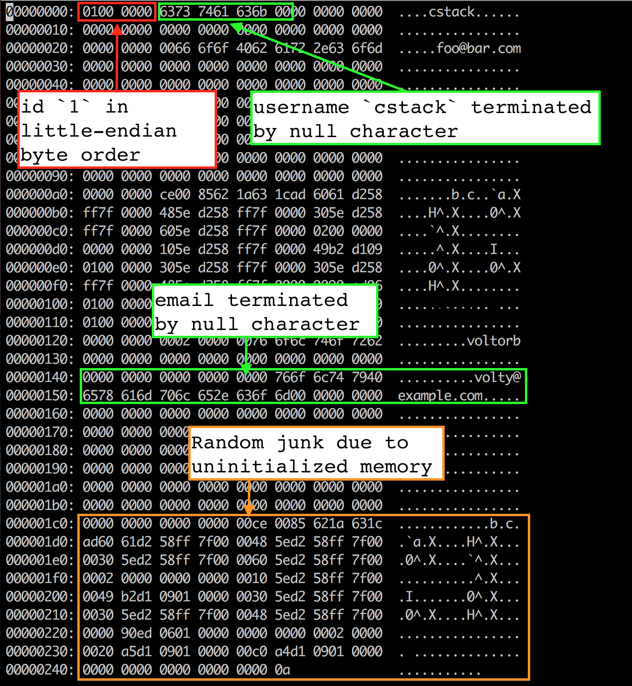

> "Nothing in the world can take the place of persistence." -- [Calvin Coolidge](https://en.wikiquote.org/wiki/Calvin_Coolidge)

우리 데이터베이스는 레코드를 삽입하고 읽어 내는 것도 되지만 프로그램 실행하는 동안에만 유지된다. 프로그램이 죽고 다시 시작되면 모든 레코드는 사라져 있다. 
우리가 원하는 행동에 대한 사양은 다음과 같다.

```ruby
it 'keeps data after closing connection' do
  result1 = run_script([
    "insert 1 user1 person1@example.com",
    ".exit",
  ])
  expect(result1).to eq([
    "db > Executed.",
    "db > ",
  ])
  result2 = run_script([
    "select",
    ".exit",
  ])
  expect(result2).to eq([
    "db > (1, user1, person1@example.com)",
    "Executed.",
    "db > ",
  ])
end
```

sqlite 처럼 파일에 전체 데이터베이스를 저장함으로써 레코드를 유지할 것이다.

우리는 이미 페이지 크기의 메모리 블록에 행을 직렬화하여 스스로 설정 했다. 지속성을 위해 
메모리 블록을 파일에 쓰고, 다음에 프로그램을 시작할 때 다시 메모리에 읽을 수 있다.

쉽게 만들기 위해 pager라는 추상화를 할 것이다. 페이지 `x` 번호를 pager에 요청하면 pager는 그 번호의 메모리 블록을 줄 것이다. 
먼저 캐시에서 찾다. 캐시 누락시, 디스크의 데이터를 메모리로 복사한다.




pager는 페이지 캐시와 파일에 접근한다. 테이블 객체는 pager를 통해 페이지에 요청한다.:
```diff
+struct Pager_t {
+  int file_descriptor;
+  uint32_t file_length;
+  void* pages[TABLE_MAX_PAGES];
+};
+typedef struct Pager_t Pager;
+
 struct Table_t {
-  void* pages[TABLE_MAX_PAGES];
+  Pager* pager;
   uint32_t num_rows;
 };
```

이제 데이터베이스에 연결하는 기능이 있기 때문에  `new_table()`을 `db_open()`으로 변경했다. 연결을 열면, 다음과 같은 의미이다.: 

- 데이터베이스 파일을 여는 것
- 페이저 자료 구조 초기화
- 테이블 자료 구조 초기화

```diff
-Table* new_table() {
+Table* db_open(const char* filename) {
+  Pager* pager = pager_open(filename);
+  uint32_t num_rows = pager->file_length / ROW_SIZE;
+
   Table* table = malloc(sizeof(Table));
-  table->num_rows = 0;
+  table->pager = pager;
+  table->num_rows = num_rows;

   return table;
 }
```

`db_open()`은 데이터베이스 파일을 열고 파일 크기를 추적하기 위해 `pager_open()`을 호출한다. 페이지 캐시는 모두 `NULL`로 초기화한다.

```diff
+Pager* pager_open(const char* filename) {
+  int fd = open(filename,
+                O_RDWR |      // Read/Write mode
+                    O_CREAT,  // Create file if it does not exist
+                S_IWUSR |     // User write permission
+                    S_IRUSR   // User read permission
+                );
+
+  if (fd == -1) {
+    printf("Unable to open file\n");
+    exit(EXIT_FAILURE);
+  }
+
+  off_t file_length = lseek(fd, 0, SEEK_END);
+
+  Pager* pager = malloc(sizeof(Pager));
+  pager->file_descriptor = fd;
+  pager->file_length = file_length;
+
+  for (uint32_t i = 0; i < TABLE_MAX_PAGES; i++) {
+    pager->pages[i] = NULL;
+  }
+
+  return pager;
+}
```

새로운 추상화에 따라 페이지를 가져오는 로직 자체를 메소드로 옮긴다.:

```diff
 void* row_slot(Table* table, uint32_t row_num) {
   uint32_t page_num = row_num / ROWS_PER_PAGE;
-  void* page = table->pages[page_num];
-  if (!page) {
-    // Allocate memory only when we try to access page
-    page = table->pages[page_num] = malloc(PAGE_SIZE);
-  }
+  void* page = get_page(table->pager, page_num);
   uint32_t row_offset = row_num % ROWS_PER_PAGE;
   uint32_t byte_offset = row_offset * ROW_SIZE;
   return page + byte_offset;
 }
```

`get_page()` 메소드는 캐시 미참조를 다루는 로직을 가지고 있다.
페이지는 데이터베이스 파일에서 순차적으로 저장된다고 가정한다 : 페이지 0은 오프셋 0, 페이지 1은 오프셋 4046, 페이지 2는 오프셋 8092 등 이다. 요청한 페이지가 파일의 경계를 벗어난다면 우리는 그 파일이 비어 있어야한다는 것을 알기 때문에 메모리를 할당하면 된다.
디스크에 캐시를 나중에 플러시 할 때 파일이 추가될 것이다.

```diff
+void* get_page(Pager* pager, uint32_t page_num) {
+  if (page_num > TABLE_MAX_PAGES) {
+    printf("Tried to fetch page number out of bounds. %d > %d\n", page_num,
+           TABLE_MAX_PAGES);
+    exit(EXIT_FAILURE);
+  }
+
+  if (pager->pages[page_num] == NULL) {
+    // Cache miss. Allocate memory and load from file.
+    void* page = malloc(PAGE_SIZE);
+    uint32_t num_pages = pager->file_length / PAGE_SIZE;
+
+    // We might save a partial page at the end of the file
+    if (pager->file_length % PAGE_SIZE) {
+      num_pages += 1;
+    }
+
+    if (page_num <= num_pages) {
+      lseek(pager->file_descriptor, page_num * PAGE_SIZE, SEEK_SET);
+      ssize_t bytes_read = read(pager->file_descriptor, page, PAGE_SIZE);
+      if (bytes_read == -1) {
+        printf("Error reading file: %d\n", errno);
+        exit(EXIT_FAILURE);
+      }
+    }
+
+    pager->pages[page_num] = page;
+  }
+
+  return pager->pages[page_num];
+}
```

사용자가 데이터베이스 연결을 닫을 때까지 캐시를 디스크로 플러시할 때까지 기다릴 것이다.
사용자가 종료했을 때, `db_close()`를 새로 호출할 것이다.

- 페이지 캐시를 디스크로 플러시
- 데이터베이스 파일 닫기
- pager와 테이블 메모리 해제

```diff
+void db_close(Table* table) {
+  Pager* pager = table->pager;
+  uint32_t num_full_pages = table->num_rows / ROWS_PER_PAGE;
+
+  for (uint32_t i = 0; i < num_full_pages; i++) {
+    if (pager->pages[i] == NULL) {
+      continue;
+    }
+    pager_flush(pager, i, PAGE_SIZE);
+    free(pager->pages[i]);
+    pager->pages[i] = NULL;
+  }
+
+  // There may be a partial page to write to the end of the file
+  // This should not be needed after we switch to a B-tree
+  uint32_t num_additional_rows = table->num_rows % ROWS_PER_PAGE;
+  if (num_additional_rows > 0) {
+    uint32_t page_num = num_full_pages;
+    if (pager->pages[page_num] != NULL) {
+      pager_flush(pager, page_num, num_additional_rows * ROW_SIZE);
+      free(pager->pages[page_num]);
+      pager->pages[page_num] = NULL;
+    }
+  }
+
+  int result = close(pager->file_descriptor);
+  if (result == -1) {
+    printf("Error closing db file.\n");
+    exit(EXIT_FAILURE);
+  }
+  for (uint32_t i = 0; i < TABLE_MAX_PAGES; i++) {
+    void* page = pager->pages[i];
+    if (page) {
+      free(page);
+      pager->pages[i] = NULL;
+    }
+  }
+  free(pager);
+}
+
-MetaCommandResult do_meta_command(InputBuffer* input_buffer) {
+MetaCommandResult do_meta_command(InputBuffer* input_buffer, Table* table) {
   if (strcmp(input_buffer->buffer, ".exit") == 0) {
+    db_close(table);
     exit(EXIT_SUCCESS);
   } else {
     return META_COMMAND_UNRECOGNIZED_COMMAND;
```

현재 설계로는 파일의 길이가 데이터베이스에 행 수를 인코딩하므로 파일 끝에 부분 페이지를 작성해야한다. `pager_flush()`가 페이지 번호와 크기를 둘 다 받는 이유이다. 최선의 설계는 아니지만 B-tree 구한하기 시작할 때 꽤 빨리 사라질 것이다.

```diff
+void pager_flush(Pager* pager, uint32_t page_num, uint32_t size) {
+  if (pager->pages[page_num] == NULL) {
+    printf("Tried to flush null page\n");
+    exit(EXIT_FAILURE);
+  }
+
+  off_t offset = lseek(pager->file_descriptor, page_num * PAGE_SIZE, SEEK_SET);
+
+  if (offset == -1) {
+    printf("Error seeking: %d\n", errno);
+    exit(EXIT_FAILURE);
+  }
+
+  ssize_t bytes_written =
+      write(pager->file_descriptor, pager->pages[page_num], size);
+
+  if (bytes_written == -1) {
+    printf("Error writing: %d\n", errno);
+    exit(EXIT_FAILURE);
+  }
+}
```

마침내, 명령어 인자로 파일 명을 받을 필요가 있다.:
```diff
 int main(int argc, char* argv[]) {
-  Table* table = new_table();
+  if (argc < 2) {
+    printf("Must supply a database filename.\n");
+    exit(EXIT_FAILURE);
+  }
+
+  char* filename = argv[1];
+  Table* table = db_open(filename);
+
```

이러한 변화는 데이터베이스에 다시 연결할 수 있고 우리의 레코드는 여전히 있다!

```
~ ./db mydb.db
db > insert 1 cstack foo@bar.com
Executed.
db > insert 2 voltorb volty@example.com
Executed.
db > .exit
~
~ ./db mydb.db
db > select
(1, cstack, foo@bar.com)
(2, voltorb, volty@example.com)
Executed.
db > .exit
~
```

`mydb.db`를 보고 데이터가 어떻게 저장되고 있는지 알아보자. vim을 이용해 파일의 메모리 계층을 16진수 편집기로 볼 수 있다.:

```
vim mydb.db
:%!xxd
```




처음 4 바이트는 행의 id 이다. (uint32_t 으로 저장했기 때문) 리틀 엔디안으로 저장된다.
 최소 시그니피건트 바이트가 먼저(01), 고차 바이트(00 00 00)가 그 뒤를 잇는다.
`memcpy()`를 사용해 `Row`의 구조에서 페이지 캐시로 바이트를 복사했기 때문에 그 구조물은 리틀-엔디안 바이트 순서로 메모리에 배치되었다. 이는 프로그램을 컴파일하는 기계의 특성 때문이다. 만약 우리가 내 컴퓨터에 데이터베이스 파일을 쓰고, 그것을 빅 엔디안 방식으로 기계에서 읽기를 원한다면, 바이트를 항상 같은 순서로 저장하고 읽도록 `serialize_row()`와 `deserialize_row()` 방법을 변경해야 할 것이다.

다음 33 바이트는 username 끝에 null을 저장한다. 분명히 ASCII 16진수에서 "cstack"은 "63 73 74 61 63 6b"이고 그 다음으로는 "null 문자"가 있다.

다음 256 바이트 email도 마찬가지이다. 여기서 우리는 종료된 null 문자 뒤에 임의의 쓰레기 값을 볼 수 있다. 이는 Row 구조채에서 초기화가 되지 않은 메모리 때문일 가능성이 높다. 문자열 종료 후 바이트를 포함하여 256바이트 email 버퍼 전체를 파일에 복사한다. 우리가 구조체을 할당했을 때 메모리에 무엇이든 간에 여전히 거기에 있다. 그러나 종지부를 찍는 null 문자를 사용하기 때문에 행동에는 아무런 영향을 미치지 않는다.

## Conclusion

지속성을 구현했으나 완전하지는 않다. 예를 들어 `.exit` 명령이 아닌 종료는 데이터 손실이 있게 된다. 추가적으로 디스크에 모든 페이지를 쓰게 되면 디스크에서 읽은 이후로 변경되지 않은 페이지도 있습니다.
우리는 모든 페이지를 디스크로 다시 쓰고 있고, 심지어 디스크에서 읽은 이후로 변경되지 않은 페이지도 쓰고 있다. 이 문제는 나중에 다루어 보자.
다음은 B-tree를 구현해볼 것이다.

## Complete Diff
```diff
+#include <errno.h>
+#include <fcntl.h>
 #include <stdbool.h>
 #include <stdio.h>
 #include <stdlib.h>
 #include <string.h>
+#include <unistd.h>
 
 struct InputBuffer_t {
   char* buffer;
@@ -61,8 +64,15 @@ const uint32_t TABLE_MAX_PAGES = 100;
 const uint32_t ROWS_PER_PAGE = PAGE_SIZE / ROW_SIZE;
 const uint32_t TABLE_MAX_ROWS = ROWS_PER_PAGE * TABLE_MAX_PAGES;
 
-struct Table_t {
+struct Pager_t {
+  int file_descriptor;
+  uint32_t file_length;
   void* pages[TABLE_MAX_PAGES];
+};
+typedef struct Pager_t Pager;
+
+struct Table_t {
+  Pager* pager;
   uint32_t num_rows;
 };
 typedef struct Table_t Table;
@@ -83,21 +93,79 @@ void deserialize_row(void* source, Row* destination) {
   memcpy(&(destination->email), source + EMAIL_OFFSET, EMAIL_SIZE);
 }
 
+void* get_page(Pager* pager, uint32_t page_num) {
+  if (page_num > TABLE_MAX_PAGES) {
+    printf("Tried to fetch page number out of bounds. %d > %d\n", page_num,
+           TABLE_MAX_PAGES);
+    exit(EXIT_FAILURE);
+  }
+
+  if (pager->pages[page_num] == NULL) {
+    // Cache miss. Allocate memory and load from file.
+    void* page = malloc(PAGE_SIZE);
+    uint32_t num_pages = pager->file_length / PAGE_SIZE;
+
+    // We might save a partial page at the end of the file
+    if (pager->file_length % PAGE_SIZE) {
+      num_pages += 1;
+    }
+
+    if (page_num <= num_pages) {
+      lseek(pager->file_descriptor, page_num * PAGE_SIZE, SEEK_SET);
+      ssize_t bytes_read = read(pager->file_descriptor, page, PAGE_SIZE);
+      if (bytes_read == -1) {
+        printf("Error reading file: %d\n", errno);
+        exit(EXIT_FAILURE);
+      }
+    }
+
+    pager->pages[page_num] = page;
+  }
+
+  return pager->pages[page_num];
+}
+
 void* row_slot(Table* table, uint32_t row_num) {
   uint32_t page_num = row_num / ROWS_PER_PAGE;
-  void* page = table->pages[page_num];
-  if (!page) {
-    // Allocate memory only when we try to access page
-    page = table->pages[page_num] = malloc(PAGE_SIZE);
-  }
+  void* page = get_page(table->pager, page_num);
   uint32_t row_offset = row_num % ROWS_PER_PAGE;
   uint32_t byte_offset = row_offset * ROW_SIZE;
   return page + byte_offset;
 }
 
-Table* new_table() {
+Pager* pager_open(const char* filename) {
+  int fd = open(filename,
+                O_RDWR |      // Read/Write mode
+                    O_CREAT,  // Create file if it does not exist
+                S_IWUSR |     // User write permission
+                    S_IRUSR   // User read permission
+                );
+
+  if (fd == -1) {
+    printf("Unable to open file\n");
+    exit(EXIT_FAILURE);
+  }
+
+  off_t file_length = lseek(fd, 0, SEEK_END);
+
+  Pager* pager = malloc(sizeof(Pager));
+  pager->file_descriptor = fd;
+  pager->file_length = file_length;
+
+  for (uint32_t i = 0; i < TABLE_MAX_PAGES; i++) {
+    pager->pages[i] = NULL;
+  }
+
+  return pager;
+}
+
+Table* db_open(const char* filename) {
+  Pager* pager = pager_open(filename);
+  uint32_t num_rows = pager->file_length / ROW_SIZE;
+
   Table* table = malloc(sizeof(Table));
-  table->num_rows = 0;
+  table->pager = pager;
+  table->num_rows = num_rows;
 
   return table;
 }
@@ -127,8 +195,71 @@ void read_input(InputBuffer* input_buffer) {
   input_buffer->buffer[bytes_read - 1] = 0;
 }
 
-MetaCommandResult do_meta_command(InputBuffer* input_buffer) {
+void pager_flush(Pager* pager, uint32_t page_num, uint32_t size) {
+  if (pager->pages[page_num] == NULL) {
+    printf("Tried to flush null page\n");
+    exit(EXIT_FAILURE);
+  }
+
+  off_t offset = lseek(pager->file_descriptor, page_num * PAGE_SIZE, SEEK_SET);
+
+  if (offset == -1) {
+    printf("Error seeking: %d\n", errno);
+    exit(EXIT_FAILURE);
+  }
+
+  ssize_t bytes_written =
+      write(pager->file_descriptor, pager->pages[page_num], size);
+
+  if (bytes_written == -1) {
+    printf("Error writing: %d\n", errno);
+    exit(EXIT_FAILURE);
+  }
+}
+
+void db_close(Table* table) {
+  Pager* pager = table->pager;
+  uint32_t num_full_pages = table->num_rows / ROWS_PER_PAGE;
+
+  for (uint32_t i = 0; i < num_full_pages; i++) {
+    if (pager->pages[i] == NULL) {
+      continue;
+    }
+    pager_flush(pager, i, PAGE_SIZE);
+    free(pager->pages[i]);
+    pager->pages[i] = NULL;
+  }
+
+  // There may be a partial page to write to the end of the file
+  // This should not be needed after we switch to a B-tree
+  uint32_t num_additional_rows = table->num_rows % ROWS_PER_PAGE;
+  if (num_additional_rows > 0) {
+    uint32_t page_num = num_full_pages;
+    if (pager->pages[page_num] != NULL) {
+      pager_flush(pager, page_num, num_additional_rows * ROW_SIZE);
+      free(pager->pages[page_num]);
+      pager->pages[page_num] = NULL;
+    }
+  }
+
+  int result = close(pager->file_descriptor);
+  if (result == -1) {
+    printf("Error closing db file.\n");
+    exit(EXIT_FAILURE);
+  }
+  for (uint32_t i = 0; i < TABLE_MAX_PAGES; i++) {
+    void* page = pager->pages[i];
+    if (page) {
+      free(page);
+      pager->pages[i] = NULL;
+    }
+  }
+  free(pager);
+}
+
+MetaCommandResult do_meta_command(InputBuffer* input_buffer, Table* table) {
   if (strcmp(input_buffer->buffer, ".exit") == 0) {
+    db_close(table);
     exit(EXIT_SUCCESS);
   } else {
     return META_COMMAND_UNRECOGNIZED_COMMAND;
@@ -210,14 +341,21 @@ ExecuteResult execute_statement(Statement* statement, Table* table) {
 }
 
 int main(int argc, char* argv[]) {
-  Table* table = new_table();
+  if (argc < 2) {
+    printf("Must supply a database filename.\n");
+    exit(EXIT_FAILURE);
+  }
+
+  char* filename = argv[1];
+  Table* table = db_open(filename);
+
   InputBuffer* input_buffer = new_input_buffer();
   while (true) {
     print_prompt();
     read_input(input_buffer);
 
     if (input_buffer->buffer[0] == '.') {
-      switch (do_meta_command(input_buffer)) {
+      switch (do_meta_command(input_buffer, table)) {
         case (META_COMMAND_SUCCESS):
           continue;
         case (META_COMMAND_UNRECOGNIZED_COMMAND):
diff --git a/spec/main_spec.rb b/spec/main_spec.rb
index 21561ce..bc0180a 100644
--- a/spec/main_spec.rb
+++ b/spec/main_spec.rb
@@ -1,7 +1,11 @@
 describe 'database' do
+  before do
+    `rm -rf test.db`
+  end
+
   def run_script(commands)
     raw_output = nil
-    IO.popen("./db", "r+") do |pipe|
+    IO.popen("./db test.db", "r+") do |pipe|
       commands.each do |command|
         pipe.puts command
       end
@@ -28,6 +32,27 @@ describe 'database' do
     ])
   end
 
+  it 'keeps data after closing connection' do
+    result1 = run_script([
+      "insert 1 user1 person1@example.com",
+      ".exit",
+    ])
+    expect(result1).to eq([
+      "db > Executed.",
+      "db > ",
+    ])
+
+    result2 = run_script([
+      "select",
+      ".exit",
+    ])
+    expect(result2).to eq([
+      "db > (1, user1, person1@example.com)",
+      "Executed.",
+      "db > ",
+    ])
+  end
+
   it 'prints error message when table is full' do
     script = (1..1401).map do |i|
       "insert #{i} user#{i} person#{i}@example.com"
```

And the diff to our tests:
```diff
 describe 'database' do
+  before do
+    `rm -rf test.db`
+  end
+
   def run_script(commands)
     raw_output = nil
-    IO.popen("./db", "r+") do |pipe|
+    IO.popen("./db test.db", "r+") do |pipe|
       commands.each do |command|
         pipe.puts command
       end
@@ -28,6 +32,27 @@ describe 'database' do
     ])
   end
 
+  it 'keeps data after closing connection' do
+    result1 = run_script([
+      "insert 1 user1 person1@example.com",
+      ".exit",
+    ])
+    expect(result1).to eq([
+      "db > Executed.",
+      "db > ",
+    ])
+
+    result2 = run_script([
+      "select",
+      ".exit",
+    ])
+    expect(result2).to eq([
+      "db > (1, user1, person1@example.com)",
+      "Executed.",
+      "db > ",
+    ])
+  end
+
   it 'prints error message when table is full' do
     script = (1..1401).map do |i|
       "insert #{i} user#{i} person#{i}@example.com"
```