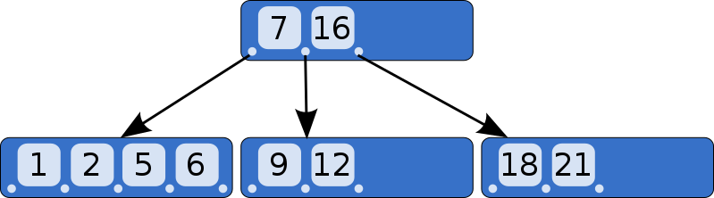

B-tree는 SQLite에서 테이블과 인덱스 둘 다 표현하기 위해 사용하는 데이터 구조이다. 이는 중요한 개념이다. 이 글은 코드는 없고 B-tree 구조만 소개할 것이다.

왜 트리 구조는 데이터베이스에 적합한 데이터 구조일까?

- 특정 값 탐색이 빠름 ( 로그 시간 )
- 삽입/삭제하는 것도 빠름 ( 균형 재조정 시간 )
- 특정 값의 범위를 순회하는 것도 빠름 ( 해시 맵과 달리 )

B-tree는 바이너리 트리와 다르다. ( "B"는 개발자의 이름을 의미할 것이지만 "balanced" 균형일 수도 있다. ). B-tree의 예시이다.

바이너리 트리와 달리, B-tree에 각 노드는 두 개 이상의 자식 노드를 가질 수 있다. 
각 노드는 m개의 자식 노드를 가질 수 있으며, 여기서 m은 트리의 "순서"이다.
트리의 균형을 유지하려면 노드에는 최소 m/2의 자식(원형)이 있어야 한다고도 한다.

예외:
- 리프 노드는 자식이 0개이다.
- 루트 노드는 적어도 2개 이상의 자식 노드를 가질 수 있다.
- 루트 노드가 리프 노드이면 자식은 0개이다.

위 사진은 SQLite가 인덱스를 저장하기 위해 이용하는 B-Tree이다. 테이블을 저장하기 위해 SQLite는 B+ tree라는 변형를 이용한다. 

|                               | B-tree         | B+ tree             |
|-------------------------------|----------------|---------------------|
| Pronounced                    | "Bee Tree"     | "Bee Plus Tree"     |
| Used to store                 | Indexes        | Tables              |
| Internal nodes store keys     | Yes            | Yes                 |
| Internal nodes store values   | Yes            | No                  |
| Number of children per node   | Less           | More                |
| Internal nodes vs. leaf nodes | Same structure | Different structure |

인덱스를 구현할 때까지는 오직 B+tree에 대해 이야기 할 것이지만 B-tree 또는 btree로 언급 할 것입니다.

자식을 가진 노드는 "internal"라 불린다. 인터널 노드와 리프 노드는 다른 구조로 되어 있다. :

| For an order-m tree... | Internal Node                 | Leaf Node           |
|------------------------|-------------------------------|---------------------|
| Stores                 | keys and pointers to children | keys and values     |
| Number of keys         | up to m-1                     | as many as will fit |
| Number of pointers     | number of keys + 1            | none                |
| Number of values       | none                          | number of keys      |
| Key purpose            | used for routing              | paired with value   |
| Stores values?         | No                            | Yes                 |

예제를 통해서 B-tree가 어떻게 엘리먼트를 넣는지에 대헤 살펴보자. 간단하게 하기 위해 트리 요구 사항은 세가지이다.:

- 인터널 노드 당 자식은 3개까지
- 인터널 노드 당 키는 2개까지
- 인터널 노드 당 적어도 2개의 자식이 있음

빈 B-tree는 한 개 노드를 가지고 있다. : 루트 노드. 루트 노드는 리프 노드로써 key/value 쌍이 없이 시작한다.:

key/value 쌍을 삽입하면 리프 노드에 순서대로 저장될 것이다.

If we insert a couple key/value pairs, they are stored in the leaf node in sorted order.

리프 노드의 용량은 key/value 두 쌍이다. 다른 노드를 삽입할 때 우리는 잎 노드를 분할하고 각 노드에 쌍의 절반을 놓아야 한다. 두 노드들은 루트 노드가 된 새로운 인터널 노드의 자식 노드가 된다.

인터널 노드는 키 한 개와 자식 노드 포인터 두 개를 갔고 있다.
키가 5 이하를 조회한다면 왼쪽 노드에서 찾으면 된다. 5 이상의 키를 찾는다면, 오른쪽 노드에서 찾으면 된다.

이제 키 "2"를 넣을 것이다.
먼저 그것이 존재한다면 어떤 리프 노드에 있을 것인지 찾아보고, 우리는 왼쪽 리프 노드에 도착한다.
노드가 가득 차면, 리프 노드를 분할하고 상위 노드에 새로운 항목을 생성한다.

계속 키를 더해보자. 18과 21.
다시 쪼개져야 하지만, 부모 노드에는 또 다른 key/pointer 쌍을 위한 공간이 없다.

Let's keep adding keys. 18 and 21. We get to the point where we have to split again, but there's no room in the parent node for another key/pointer pair.

해결책은 루트 노드를 두 인터널 노드로 나누면 된다. 그러면 새 루트 노드가 생성되고 인터널의 부모 노드가 된다.

루트 노드가 분리될 때 트리의 차수가 증가한다. 모든 리프 노드는 깊이가 같고 key/value 쌍의 수가 같으므로 트리는 균형을 유지하고 빠르게 검색한다.

노드에서 키를 삭제하는 것에 대한 논의는 삽입을 실행한 후에나 미루기로 한다.

B-tree 구조를 구현했을 때 각 노드는 한 페이지에 대응할 것이다. 루트 노드는 0 페이지에 존재할 것이다. 자식 포인터들은 자식 노드를 포함한 페이지 번호일 뿐이다.

다음엔 B-tree 구현을 시작해보자!